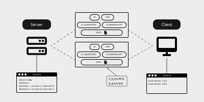

# Sistemas Distribuidos - UNIFESSPA

### Discentes

- [Gabriel Morandi Mello](https://github.com/gabrielmorandi)
- [Gustavo Paixão Machado](https://github.com/machadogustavo)

## Trabalho 02 – Sockets UDP & TCP

  

*Desenvolva as duas questões referente ao socket UDP e TCP através de uma linguagem de
programação preferida.*

### UDP

Fazer uma aplicação cliente-servidor para correção e estatística de questionários

O servidor deve ser capaz de receber várias conexões de sockets UDP de clientes
simultaneamente (multithreading).

O cliente envia ao servidor, **vários datagramas** contendo cada um uma resposta do tipo V ou F ao questionário, no seguinte formato:

`<número da questão>;<número alternativas>;<respostas>`

**Exemplo:**

```
1;5;VVFFV 
2;4;VVVV
```

O servidor lê a **mensagem** e calcula o número de acertos e erros devolvendo uma resposta
simples:

`<número da questão>;<número acertos>;<número erros>`

O servidor também faz uma estatística de acertos/erros por questão com base em todas as
questões recebidas até um certo momento. Estas informações devem ser representadas num
objeto compartilhado por todas as threads de atendimento aos clientes.

```
Estatística
Questão 1: acertos=5 erros=3
Questão 2: acertos=4 erros=4
```


### TCP

O mesmo comando que o UDP, porém o cliente envia ao servidor, um **arquivo de texto** contendo as resposta do tipo V ou F ao
questionário, no seguinte formato:

`<número da questão>;<número alternativas>;<respostas>`

**Exemplo:**

```
1;5;VVFFV 
2;4;VVVV
```

O servidor lê o **arquivo** e calcula o número de acertos e erros devolvendo uma resposta simples:

`<número da questão>;<número acertos>;<número erros>`

O servidor também faz uma estatística de acertos/erros por questão com base em os
questionários recebidos até um certo momento. Estas informações devem ser representadas num
objeto compartilhado por todas as threads de atendimento aos clientes.

```
Estatística
Questão 1: acertos=5 erros=3
Questão 2: acertos=4 erros=4
```



### Vídeo


[](https://drive.google.com/drive/folders/16jgU4M0sE4k6m3S-ryhlOr4uTK27exjk?usp=sharing)
