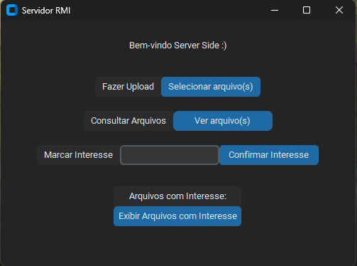

# Sistemas Distribuidos - UNIFESSPA

### Discentes

- [Gabriel Morandi Mello](https://github.com/gabrielmorandi)
- [Gustavo Paixão Machado](https://github.com/machadogustavo)

## Trabalho – RMI Python



 

*Aplicação de transferência de arquivos em uma arquitetura cliente-servidor.*

```
Utilizar a middleware Java RMI (Remote Invocation Method) ou Pyro 4/5
(Python Remote Objects) para prover a comunicação entre os clientes e o
servidor da aplicação.
```

### Métodos disponíveis no Servidor

- **Fazer upload** de arquivos para serem compartilhados;
- **Consultar** informações sobre os arquivos disponíveis;
- **Fazer download** de arquivos disponíveis;
- **Registrar interesse** em arquivos não disponíveis no momento da consulta.

*Para isso o cliente deve informar o arquivo desejado, sua referência de objeto
remoto e por quanto tempo será válido esse registro. Servidor armazena
esses interesses. Cada vez que um novo arquivo estiver disponível, o
servidor checa a lista de interesses e envia notificações aos clientes
interessados na ocorrência do evento em questão. Esse envio de notificação
ocorrerá via chamada de métodos (isto é, o servidor invocará um método do
cliente para enviar a notificação).*

- **Cancelar registro de interesse.**

### Método disponível no Cliente:

- **Notificar evento: cliente receberá notificações assíncronas de eventos
(arquivos) que sejam do seu interesse.**

### Observações:

- Não é necessário tratar tolerância a falhas do servidor;
- Não é necessário tratar de segurança;
- Desenvolva uma interface amigável;
- Documentar todo o código;
- Equipe: até 3(três) alunos.

[](https://drive.google.com/drive/folders/16jgU4M0sE4k6m3S-ryhlOr4uTK27exjk?usp=sharing)

## Documentação
# File Sharing Server

O File Sharing Server é um sistema de compartilhamento de arquivos baseado em rede usando a tecnologia RMI (Remote Method Invocation). Ele permite o upload, download e gerenciamento de arquivos entre os clientes conectados.

## Requisitos

- Python 3.x
- Biblioteca Pyro5 (instalada via `pip install Pyro5`)
- Biblioteca Tkinter (geralmente incluída na instalação do Python)

## Instruções de Uso

### Configuração do Servidor

1. Abra um terminal ou prompt de comando.
2. Navegue até o diretório onde os arquivos do servidor estão localizados.
3. Execute o seguinte comando para iniciar o servidor:

`python server.py`

O servidor será iniciado e mostrará o endereço em que está sendo executado.

### Configuração do Cliente

1. Abra outro terminal ou prompt de comando.
2. Navegue até o diretório onde os arquivos do cliente estão localizados.
3. Execute o seguinte comando para iniciar o cliente:

`python client.py`

O cliente será iniciado e uma interface gráfica será exibida.

### Funcionalidades do Cliente

- **Fazer Upload de Arquivos**: Clique no botão "Selecionar arquivo(s)" e escolha o(s) arquivo(s) que deseja fazer upload para o servidor. Os arquivos selecionados serão enviados para o servidor e armazenados lá.

- **Consultar Arquivos**: Clique no botão "Ver arquivo(s)" para visualizar a lista de arquivos disponíveis no servidor. Será aberta uma nova janela mostrando os nomes dos arquivos e os botões "Download" para baixar cada arquivo.

- **Marcar Interesse**: Digite o nome do arquivo desejado no campo de entrada "Marcar Interesse" e clique no botão "Confirmar Interesse". Isso registrará seu interesse em um determinado arquivo no servidor.

- **Desmarcar Interesse**: A lista de arquivos com interesse marcado é exibida na seção "Arquivos com Interesse". Clique no botão "Desmarcar Interesse" ao lado de um arquivo para remover seu interesse por esse arquivo.

### Funcionalidades do Servidor

O servidor possui as seguintes funcionalidades:

- **register_client(client_uri)**: Registra um cliente no servidor. Deve ser chamado pelo cliente ao se conectar ao servidor.

- **register_interest(file_name, client_uri, validity)**: Registra o interesse de um cliente em um determinado arquivo. O cliente deve fornecer o nome do arquivo, seu próprio URI e o período de validade do interesse. O interesse será armazenado no servidor.

- **upload_file(file_name, file_data_base64)**: Faz o upload de um arquivo para o servidor. O cliente deve fornecer o nome do arquivo e os dados do arquivo codificados em base64. O arquivo será armazenado no servidor e notificações serão enviadas para os clientes interessados.

- **get_file_info()**: Retorna informações sobre todos os arquivos armazenados no servidor.

- **cancel_interest(file_name, client_uri)**: Cancela o interesse de um cliente em um determinado arquivo. O cliente deve fornecer o nome do arquivo e seu próprio URI. O interesse será removido do servidor.

- **download_file(file_name)**: Faz o download de um arquivo do servidor. O cliente deve fornecer o nome do arquivo desejado. O arquivo será

 retornado em formato base64.

## Considerações Finais

O File Sharing Server permite que os clientes compartilhem arquivos entre si de forma conveniente. Os clientes podem fazer upload, download e acompanhar os arquivos de seu interesse. O servidor gerencia todas as operações de compartilhamento de arquivos e notifica os clientes quando um arquivo é enviado ou quando um interesse é cancelado.

Esse sistema é apenas um exemplo básico de como implementar um compartilhamento de arquivos usando a tecnologia RMI e não deve ser usado em produção sem a implementação de recursos adicionais de segurança e gerenciamento.


